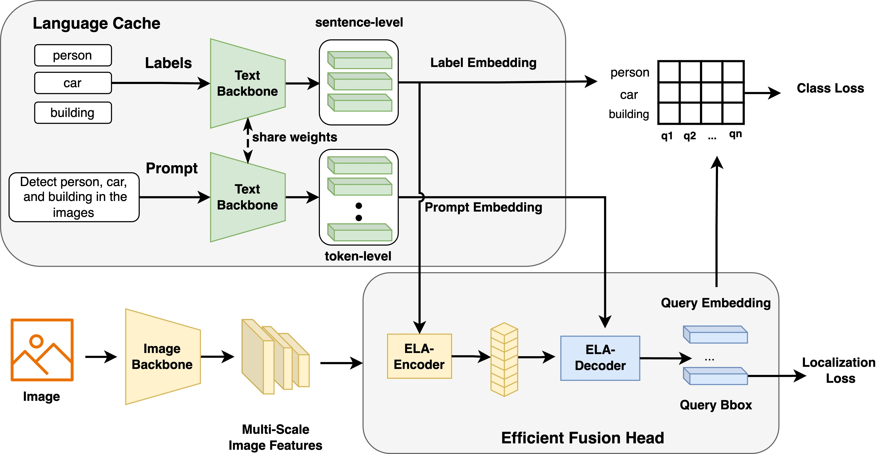
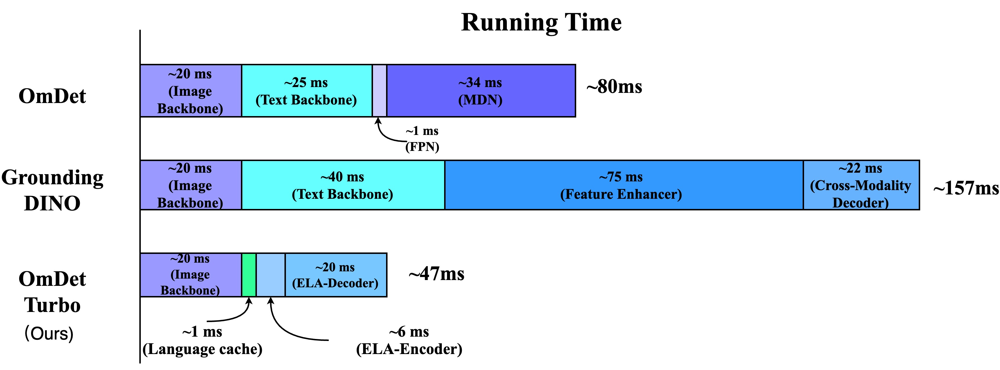
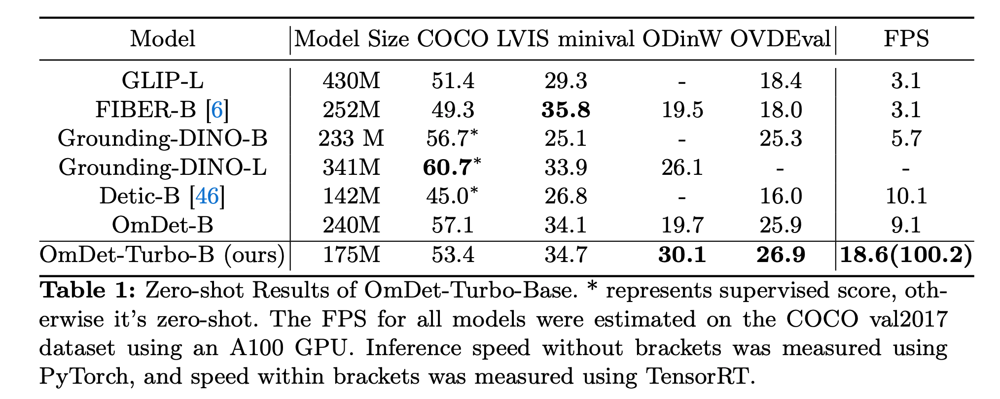

# OmDet-Turbo

<p align="center">
 <a href="https://arxiv.org/abs/2403.06892"><strong> [Paper 📄] </strong></a> <a href="https://huggingface.co/omlab/OmDet-Turbo_tiny_SWIN_T"><strong> [Model 🗂️] </strong></a>
</p>
<p align="center">
Fast and accurate open-vocabulary end-to-end object detection
</p>

***
## 🗓️ Updates
* 07/05/2024: Our new open-source project, [OmAget: A multimodal agent framework for solving complex tasks](https://github.com/om-ai-lab/OmAgent) is available !!! Additionally, OmDet has been seamlessly integrated as an OVD tool within it. Feel free to delve into our innovative multimodal agent framework. 
* 06/24/2024: Guidance for [converting OmDet-Turbo to ONNX](https://github.com/om-ai-lab/OmDet#:~:text=How%20To%20Export%20ONNX%20Model)
* 03/25/2024: Inference code and a pretrained OmDet-Turbo-Tiny model released.
* 03/12/2024: Github open-source project created

***
## 🔗 Related Works
If you are interested in our research, we welcome you to explore our other wonderful projects.

🔆 [How to Evaluate the Generalization of Detection? A Benchmark for Comprehensive Open-Vocabulary Detection](https://arxiv.org/abs/2308.13177)(AAAI24) &nbsp;🏠[Github Repository](https://github.com/om-ai-lab/OVDEval/tree/main)

🔆 [OmDet: Large-scale vision-language multi-dataset pre-training with multimodal detection network](https://ietresearch.onlinelibrary.wiley.com/doi/full/10.1049/cvi2.12268)(IET Computer Vision)

***
## 📖 Introduction
This repository is the official PyTorch implementation for **OmDet-Turbo**, a fast transformer-based open-vocabulary object detection model.

**⭐️Highlights**
1. **OmDet-Turbo** is a transformer-based real-time open-vocabulary
detector that combines strong OVD capabilities with fast inference speed.
This model addresses the challenges of efficient detection in open-vocabulary
scenarios while maintaining high detection performance.
2. We introduce the **Efficient Fusion Head**, a swift multimodal fusion module
designed to alleviate the computational burden on the encoder and reduce
the time consumption of the head with ROI. 
3. OmDet-Turbo-Base model, achieves state-of-the-art zero-shot performance on the ODinW and OVDEval datasets, with AP scores
of **30.1** and **26.86**, respectively. 
4. The inference speed of OmDetTurbo-Base on the COCO val2017 dataset reach **100.2** FPS on an A100 GPU.

For more details, check out our paper **[Real-time Transformer-based Open-Vocabulary Detection with Efficient Fusion Head](https://arxiv.org/abs/2403.06892)**



***
## ⚡️ Inference Speed
Comparison of inference speeds for each component in tiny-size model.


***
## 🛠️ How To Install 
Follow the [Installation Instructions](install.md) to set up the environments for OmDet-Turbo

***
## 🚀 How To Run
### Local Inference
1. Download our pretrained model and the [CLIP](https://huggingface.co/omlab/OmDet-Turbo_tiny_SWIN_T/resolve/main/ViT-B-16.pt?download=true) checkpoints.
2. Create a folder named **resources**, put downloaded models into this folder.
3. Run **run_demo.py**, the images with predicted results will be saved at **./outputs** folder.
### Run as a API Server
1. Download our pretrained model and the [CLIP](https://huggingface.co/omlab/OmDet-Turbo_tiny_SWIN_T/resolve/main/ViT-B-16.pt?download=true) checkpoints.
2. Create a folder named **resources**, put downloaded models into this folder.
3. Run **run_wsgi.py**, the API server will be started at **http://host_ip:8000/inf_predict**, check **http://host_ip:8000/docs** to have a try.

We already added language cache while inferring with **run_demo.py**. For more details, please open and check **run_demo.py** scripts. 


***
## ⚙️ How To Export ONNX Model
1. Replace **OmDetV2Turbo** in **OmDet-Turbo_tiny_SWIN_T.yaml** with **OmDetV2TurboInfer**
2. Run **export.py**, and the omdet.onnx will be exported.
   
In the above example, post processing is not included in onnx model , and all input size are fixed. You can add more post processing and change the input size according to your needs.


***
## 📦 Model Zoo
The performance of COCO and LVIS are evaluated under zero-shot setting.

Model | Backbone | Pre-Train Data  | COCO | LVIS | FPS (pytorch/trt) |Weight 
-- |--------|-----------------| -- | -- |-------------------| --
OmDet-Turbo-Tiny| Swin-T | O365,GoldG | 42.5 | 30.3 | 21.5/140.0 |  [weight](https://huggingface.co/omlab/OmDet-Turbo_tiny_SWIN_T/tree/main)     

***
## 📝 Main Results


***
## Citation
Please consider citing our papers if you use our projects:

```
@article{zhao2024real,
  title={Real-time Transformer-based Open-Vocabulary Detection with Efficient Fusion Head},
  author={Zhao, Tiancheng and Liu, Peng and He, Xuan and Zhang, Lu and Lee, Kyusong},
  journal={arXiv preprint arXiv:2403.06892},
  year={2024}
}
```

```
@article{zhao2024omdet,
  title={OmDet: Large-scale vision-language multi-dataset pre-training with multimodal detection network},
  author={Zhao, Tiancheng and Liu, Peng and Lee, Kyusong},
  journal={IET Computer Vision},
  year={2024},
  publisher={Wiley Online Library}
}
```
